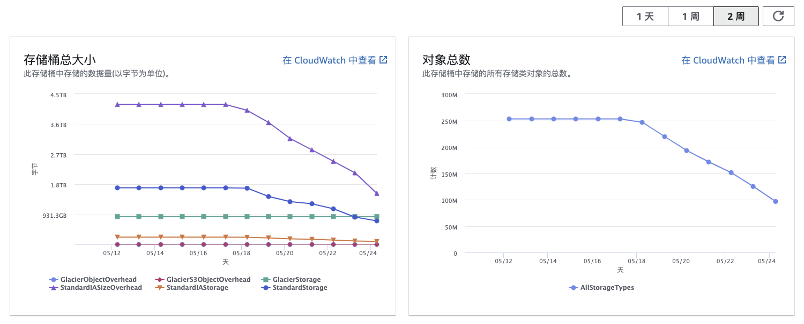

## Config 配置
### cli 配置
```yaml
profiles:
  - name: default
    ak: YOUR_AK
    sk: YOUR_SK
    region: cn-northwest-1
    endpoint: http://local.s3-proxy.patsnap.info
```

## 最佳实践

### bucket 查询相关

```bash
# 递归查询一个大量的对象，可以使用chan特性，-r 递归查询， -l limit 指定查询的数量
cbs b ls s3://patent-familydata/ -l 100 -r
# 如果对象load时间很长，-q 100 指定chan的缓冲区大小，来及时处理已经加载到内存的对象而不需要等待全部加载完毕
cbs b ls s3://patent-familydata/ -l 100 -r -q 100
```
### bucket 删除相关
```bash
# 删除对象 -p 指定profile， -f 强制删除， --thread-num 指定并发数，删除默认指定了-q 1000来及时处理已经加载到内存的对象而不需要等待全部加载完毕
cbs b rm s3://patent-familydata/ -p us0066 -r --limit 100 -f --thread-num 30
```
```bash
# 删除对象来源于指定文件 .txt txt格式必须是每个key为一行（兼容空格，空行）
cbs b rm s3://patent-familydata/ -c ./config/ -p us0066 -d --dry-run --file keys.txt 
# 删除对象来源于指定文件 .csv
cbs b rm s3://patent-familydata/ -c ./config/ -p us0066 -f --dry-run --file efc35b3c-2453-4aba-9935-1b28f331ccad.csv 
# 删除对象来源于指定目录，处理目录下所有 txt和csv结尾的文件
cbs b rm s3://patent-familydata/ -c ./config/ -p us0066 -f --dry-run --dir ./ 
```

#### 性能相关
```bash
# 单线程删除 100个对象，耗时 32秒
cbs b rm s3://patent-familydata/ -p us0066 -r --limit 100 -f -c ./config/
···
delete patent-familydata/10/00/41/05/10004105.XML success
delete patent-familydata/10/00/41/13/10004113.XML success

Total Objects: 100, Total Size: 579.22 KB, Cost Time: 32.012681066s
```
```bash
# 10线程删除 100个对象，耗时 6秒
cbs b rm s3://patent-familydata/ -p us0066 -r --limit 100 -f -c ./config/ --thread-num 10
···
delete patent-familydata/10/00/80/94/10008094.XML success
delete patent-familydata/10/00/81/33/10008133.XML success
delete patent-familydata/10/00/81/26/10008126.XML success

Total Objects: 100, Total Size: 578.13 KB, Cost Time: 5.98809868s
```

```bash
# 10线程删除 10000个对象，耗时 5分4秒
cbs b rm s3://patent-familydata/ -p us0066 -r --limit 10000 -f -c ./config/ --thread-num 10
···
delete patent-familydata/10/54/35/33/10543533.XML success
delete patent-familydata/10/54/35/34/10543534.XML success
delete patent-familydata/10/54/35/38/10543538.XML success
delete patent-familydata/10/54/35/43/10543543.XML success

Total Objects: 10000, Total Size: 51.94 MB, Cost Time: 5m4.816449186s
```
```bash
# 100线程删除 10000个对象，耗时 45秒
cbs b rm s3://patent-familydata/ -p us0066 -r --limit 10000 -f -c ./config/ --thread-num 100
···
delete patent-familydata/10/57/31/00/10573100.XML success
delete patent-familydata/10/57/30/91/10573091.XML success
delete patent-familydata/10/57/31/07/10573107.XML success

Total Objects: 10000, Total Size: 21.10 MB, Cost Time: 45.873002895s
```
```bash
#  150线程删除 1.9亿个对象，耗时 152小时
[root@zhoushoujianworkspace cloud-bucket-sync]# cbs b rm --dir tests/ --thread-num 150  s3://patent-familydata/ -f -p us0066 --error-file tests/error.txt -c ./config/
···
delete patent-familydata/DOCDB/PATENT/CH/69/43/34/A5/CH694334A5_20130328.zip success
delete patent-familydata/DOCDB/PATENT/CH/69/43/38/A5/CH694338A5_20210617.zip success
delete patent-familydata/DOCDB/PATENT/CH/69/43/28/A5/CH694328A5_20210624.zip success
delete patent-familydata/DOCDB/PATENT/CH/69/43/18/A5/CH694318A5_20130328.zip success

Total Objects: 192825659, Total Size: 0 B, Cost Time: 152h43m32.982637125s
```

thread-num | 100 | 10000 |640万| 1秒对象|失败个数
---|---|---|---|---|---
1 | 32.012681066s | - |- | 3.125个/s|-
10 | 5.98809868s | 5m4.816449186s | - |16.666个/s 32.89个/s|-
100 | - | 45.873002895s - |-| 217.39个/s|-
150 | - | - | 5h37m57.563273064s|  326.08个/s|1700

##### 最佳实践
- 删除3亿数据，开了150个线程，平均每天删除三千万对象，耗时2周左右。 更多的线程会导致失败率增加，建议不要超过150个线程。（aws api限制）



#### 同步相关
```bash
# 同步本地目录到bucket


```
```bash
# 下载
[root@zhoushoujianworkspace cloud-bucket-sync]# cbs b sync s3://ops-9554/p.patsnap.info/static/popAPI.png ./123/
2023-05-25T18:45:38.658+0800    INFO    cmd/bucket.go:328       download success: ./123/popAPI.png
# 再次下载会跳过，可以用-f 覆盖
[root@zhoushoujianworkspace cloud-bucket-sync]# cbs b sync s3://ops-9554/p.patsnap.info/static/popAPI.png ./123/
2023-05-25T18:45:13.840+0800    INFO    cmd/bucket.go:315       same etag for ./123/popAPI.png, skip.
# 下载大文件

```
```bash
# 同步bucket到bucket
[root@zhoushoujianworkspace cloud-bucket-sync]# cbs b sync s3://ops-9554/p.patsnap.info/static/popAPI.png s3://ops-9554/123/
2023-05-25T18:49:20.854+0800    INFO    io/bucket.go:261        copy s3://ops-9554/p.patsnap.info/static/popAPI.png => s3://ops-9554/123/popAPI.png 82.94 KB
[root@zhoushoujianworkspace cloud-bucket-sync]# cbs b sync s3://ops-9554/p.patsnap.info/static/popAPI.png s3://ops-9554/123/
2023-05-25T18:49:26.716+0800    INFO    cmd/bucket.go:282       same etag for 123/popAPI.png, skip.
[root@zhoushoujianworkspace cloud-bucket-sync]# cbs b sync s3://ops-9554/p.patsnap.info/static/popAPI.png s3://ops-9554/123/ -f
2023-05-25T18:49:33.425+0800    INFO    io/bucket.go:261        copy s3://ops-9554/p.patsnap.info/static/popAPI.png => s3://ops-9554/123/popAPI.png 82.94 KB
```
```bash
# 同步bucket到bucket但是不是同一个profile，需要用到下载和本地上传

# 没有用到分片下载上传特性，即文件小于5GB
[root@zhoushoujianworkspace cloud-bucket-sync]# go run main.go b sync s3://ops-9554/zhoushoujiantest/123/22021225.0.1 s3://zhoushoujiantest/123/one --profile_to us0066
2023-05-26T14:08:52.634+0800    INFO    io/bucket.go:455        copy s3://ops-9554/zhoushoujiantest/123/22021225.0.1 => s3://zhoushoujiantest/123/one22021225.0.1 50.00 MB

# 用到了分片下载上传特性，即文件大于5GB (这里模拟修改了最大指标，5GB换成5MB)
[root@zhoushoujianworkspace cloud-bucket-sync]# go run main.go b sync s3://ops-9554/zhoushoujiantest/123/22021225.0.1.1 s3://zhoushoujiantest/123/ --profile_to us0066
2023-05-26T14:06:38.611+0800    INFO    io/bucket.go:482        UploadPart s3://zhoushoujiantest/123/22021225.0.1.1 1/4
2023-05-26T14:06:50.214+0800    INFO    io/bucket.go:482        UploadPart s3://zhoushoujiantest/123/22021225.0.1.1 2/4
2023-05-26T14:07:03.111+0800    INFO    io/bucket.go:482        UploadPart s3://zhoushoujiantest/123/22021225.0.1.1 3/4
2023-05-26T14:07:19.456+0800    INFO    io/bucket.go:482        UploadPart s3://zhoushoujiantest/123/22021225.0.1.1 4/4
2023-05-26T14:07:20.172+0800    INFO    io/bucket.go:488        muticopy s3://ops-9554/zhoushoujiantest/123/22021225.0.1.1 => s3://zhoushoujiantest/123/22021225.0.1.1 50.00 MB
```


### 关于Etag的问题
通过headobj得到分片的ContentLength大小来解决分片大小不一致导致的etag不同的问题。
```bash
# 控制台上传的文件16M分片 16*7=112M
[root@zhoushoujianworkspace cloud-bucket-sync]# cbs b ls s3://ops-9554/zhoushoujiantest/20230527_62559104-98af-4eed-a857-6c50bedcaa40/1685198194.mkv
                                       KEY                                      | TYPE |    LAST MODIFIED    |   SIZE    |                 ETAG                  
--------------------------------------------------------------------------------+------+---------------------+-----------+---------------------------------------
  zhoushoujiantest/20230527_62559104-98af-4eed-a857-6c50bedcaa40/1685198194.mkv |      | 2023-06-01 03:26:48 | 103.14 MB | "7aef6cbd0bdfd3856021960ac9188cea-7"  
--------------------------------------------------------------------------------+------+---------------------+-----------+---------------------------------------
                                                                                           TOTAL OBJECTS:    | 103.14 MB |                  1                    
                                                                                       ----------------------+-----------+---------------------------------------
# aws s3 cp 该文件得到不一样 分片数为13 103.14/13=7.94M 单分片
[root@zhoushoujianworkspace cloud-bucket-sync]# cbs b ls s3://ops-9554/zhoushoujiantest/awss3/1685198194.mkv
                   KEY                  | TYPE |    LAST MODIFIED    |   SIZE    |                 ETAG                   
----------------------------------------+------+---------------------+-----------+----------------------------------------
  zhoushoujiantest/awss3/1685198194.mkv |      | 2023-06-01 05:36:16 | 103.14 MB | "aeca7e57a0f5a786841ccbf043706ffa-13"  
----------------------------------------+------+---------------------+-----------+----------------------------------------
                                                   TOTAL OBJECTS:    | 103.14 MB |                   1                    
                                               ----------------------+-----------+----------------------------------------
# aws s3 再次cp 该文件得到一样 分片数为7 103.14/7=14.73M 单分片
[root@zhoushoujianworkspace cloud-bucket-sync]# cbs b ls s3://ops-9554/zhoushoujiantest/s3_cbs_1
                   KEY                   | TYPE |    LAST MODIFIED    |   SIZE    |                 ETAG                   
-----------------------------------------+------+---------------------+-----------+----------------------------------------
               zhoushoujiantest/s3_cbs_1 |      | 2023-06-01 05:38:45 | 103.14 MB | "aeca7e57a0f5a786841ccbf043706ffa-13"  
-----------------------------------------+------+---------------------+-----------+----------------------------------------
                                                    TOTAL OBJECTS:    | 103.14 MB |                   1                    
                                                ----------------------+-----------+----------------------------------------

# cbs servercp 13分片的 结果不一样
[root@zhoushoujianworkspace cloud-bucket-sync]# cbs b ls s3://ops-9554/zhoushoujiantest/s3_cbs_
                   KEY                   | TYPE |    LAST MODIFIED    |   SIZE    |                 ETAG                   
-----------------------------------------+------+---------------------+-----------+----------------------------------------
  zhoushoujiantest/s3_cbs_1685198194.mkv |      | 2023-06-01 05:37:34 | 103.14 MB | "678863e5e6005846c93e539fa48c980b-13"  
-----------------------------------------+------+---------------------+-----------+----------------------------------------
                                                    TOTAL OBJECTS:    | 103.14 MB |                   1                    
                                                ----------------------+-----------+----------------------------------------
# cbs servercp 7分片的 结果不一样
[root@zhoushoujianworkspace cloud-bucket-sync]# cbs b ls s3://ops-9554/zhoushoujiantest/1685198194.mkv
                KEY               | TYPE |    LAST MODIFIED    |   SIZE    |                 ETAG                  
----------------------------------+------+---------------------+-----------+---------------------------------------
  zhoushoujiantest/1685198194.mkv |      | 2023-06-01 05:27:38 | 103.14 MB | "c2154af9af76e4c84f78bc8897d86608-7"  
----------------------------------+------+---------------------+-----------+---------------------------------------
                                             TOTAL OBJECTS:    | 103.14 MB |                  1                    
                                         ----------------------+-----------+---------------------------------------
# cbs 跨区域同步 7分片的 结果一样                                      
[root@zhoushoujianworkspace cloud-bucket-sync]# cbs b ls s3://zhoushoujiantest/1685198194.mkv
       KEY       | TYPE |    LAST MODIFIED    |   SIZE    |                 ETAG                  
-----------------+------+---------------------+-----------+---------------------------------------
  1685198194.mkv |      | 2023-06-01 05:10:10 | 103.14 MB | "c2154af9af76e4c84f78bc8897d86608-7"  
-----------------+------+---------------------+-----------+---------------------------------------
                            TOTAL OBJECTS:    | 103.14 MB |                  1                    
                        ----------------------+-----------+---------------------------------------
# 指定分片大小的ContentLength为源的切片大小能保证ETAG一致
[root@zhoushoujianworkspace cloud-bucket-sync]# cbs b ls s3://ops-9554/zhoushoujiantest/serverside/1685198194.mkv
                     KEY                     | TYPE |    LAST MODIFIED    |   SIZE    |                 ETAG                  
---------------------------------------------+------+---------------------+-----------+---------------------------------------
  zhoushoujiantest/serverside/1685198194.mkv |      | 2023-06-01 07:45:05 | 103.14 MB | "7aef6cbd0bdfd3856021960ac9188cea-7"  
---------------------------------------------+------+---------------------+-----------+---------------------------------------
                                                        TOTAL OBJECTS:    | 103.14 MB |                  1                    
                                                    ----------------------+-----------+---------------------------------------

```