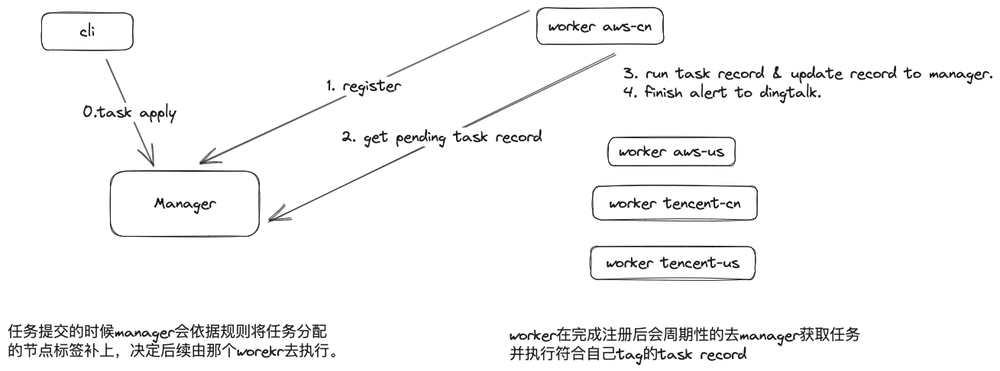

## 1. 简介
`cbs` 是一个云原生的用来实现不同云对象存储的同步的工具。可以托管任务，也可以cli执行。目前支持S3协议类型的对象存储同步。
- 支持对象操作，包括查询、删除、下载、上传、复制、同步等（比aws cli的优势是支持不同云的对象，或者aws不同地域的桶同步）
- 支持将同步任务提交到后台执行，支持任务状态查询，支持任务状态钉钉机器人告警
- cbs自身的实现了任务管理功能，确保提交的任务能够被执行。任务支持周期性执行和实时目录同步
---
## 2. 架构


---
## 3. 功能介绍
### 3.1 task管理
- 支持任务提交`cbs task apply -f task.json`
- 支持任务执行`cbs task exec {task_id}`
- 支持任务查看 `cbs task show {task_id}`

更多信息： [cbs task command](./docs/cbs-task.md)
### 3.2 对象管理

- 支持对象查询`cbs bucket ls {s3_url} -l {limit}`
- 支持对象删除`cbs bucket rm {s3_url}`
- 支持对象下载`cbs bucket sync {s3_url} {local_path}`
- 支持对象上传`cbs bucket sync {local_path} {s3_url}`
- 支持对象复制、同步（支持跨不同账号，不同云厂商，需要支持s3协议）`cbs bucket sync {s3_url} {s3_url}`

更多信息： [cbs bucket command](./docs/cbs-bucket.md)
### 3.3 manager功能
- 提供API接口
- 提供自修复任务
- 提供任务状态钉钉机器人告警

更多信息：[cbs manager command](./docs/cbs-manager.md)

### 3.4 worker功能
- 提供任务执行，自身带上cloud和region信息，用来跑时候自身的任务（出于流量费用，网络速度的考虑）
- 支持任务并发执行

更多信息：[cbs worker command](./docs/cbs-worker.md)

---
## 4 启动
### 4.1 启动manager
```bash
cbs manager start --port 8012
```

### 4.2 启动worker
需要配置一个config `～/.cbs/cli.yaml`

```bash
[root@zhoushoujianworkspace cloud-bucket-sync]# cat > ~/.cbs/cli.yaml <<EOF
manager:
  endpoint: http://localhost:8012
  api_version: api/v1
EOF

# cloud 和 reigon 会决定task是否在这个节点跑。对应task 自动补充的worker_tag字段。比如aws-cn才会被一下worker执行。
[root@zhoushoujianworkspace cloud-bucket-sync]# cbs worker start --cloud aws --region cn -c ～/.cbs/
```
### 4.3 提交一个任务
```bash
[root@zhoushoujianworkspace cloud-bucket-sync]# cat > task.yaml <<EOF
[
    {
        "name": "测试服务端的同步任务",
        "exclude": "",
        "include": "",
        "is_server_side": true,
        "source_profile": "cn9554",
        "source_url": "s3://ops-9554/cbs/serverSideTask/",
        "submitter": "zhoushoujian",
        "sync_mode": "syncOnce",
        "target_profile": "cn9554",
        "target_url": "s3://ops-9554/cbs/test/serverSideTask/",
        "time_after": "",
        "time_before": "",
        "storage_class":""
    }
]
EOF

[root@zhoushoujianworkspace cloud-bucket-sync]# cbs task apply -f task.json
"8d66f2fb-e05b-435c-9909-b488b93e808a"

[root@zhoushoujianworkspace cloud-bucket-sync]# cbs task show 
                   ID                  |           NAME           |     WORKERTAG      | SYNCMODE |  SUBMITTER   |                     RECORDS                      
---------------------------------------+--------------------------+--------------------+----------+--------------+--------------------------------------------------
  8d66f2fb-e05b-435c-9909-b488b93e808a | 测试服务端的同步任务     | aws-cn             | syncOnce | zhoushoujian | pending:1,running:0,success:0,failed:0,cancel:0  
---------------------------------------+--------------------------+--------------------+----------+--------------+--------------------------------------------------
                                                                                                       COUNT     |                        1                         
                                                                                                  ---------------+--------------------------------------------------
```
---

## 5. 更新日志

### 2023-05-30
- 增加后端接口在query的时候，按照created_at排序.

### 2023-05-29
- 移除Task任务提交的时候的worker_tag字段的自动补充，改为创建时候提供。
- 增加manager对定时任务的支持，轮询任务corn字段，执行任务。